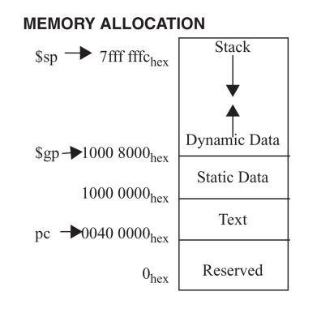
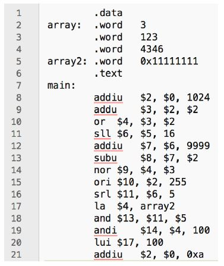
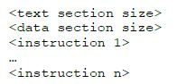

# Implementing a MIPS Assembler

## 개요
이 프로젝트는 MIPS ISA assembler를 구현하는 것이다. assembler는 assembly code를 binary 파일로 변환하는 도구이다.
이 프로젝트의 목표는 MIPS ISA instruction set을 이해하고 assembler의 원리를 숙지하기 위한 것이다.


## 사용된 환경 & version
- Ubuntu 18.04.1 LTS (64bit)
- gcc (Ubuntu 7.4.0-1ubuntu1~18.04.1) 7.4.0


## 사용 시 주의사항

**object파일 생성 및 assembler 테스트**

```bash
make
make test
```

**생성 된 object파일 삭제**

```bash
make clean
```

**직접 object 파일 생성 및 하나씩 test방법**
```bash
make
./assembler sample_input/?.s //'?' 에 파일 명 입력
diff -Naur sample_input/?.o sample_output/?.o; //'?' 에 파일 명 입력
```


## 기능 설명

### Instruction Set

- 상세한 instruction 정보는 /handout/MIPS_Green_Sheet.pdf 를 참고한다
    - unsinged operation에 대한 instruction만 구현 (addu, addiu, subu, sltiu, sltu, sll, srl)
    - 단, 특정 instruction에 대한 immediate 필드는 음수가 혀용되도록 확장된 기호로 표시 (addui, beq, bne, lw, sw, sltui)
    - 4Byte의 word 형태로 load와 store 구현
    - assembler는 immediate 필드에 대해 10진수 및 16진수와 .data 섹션을 지원
    - 레지스터의 이름은 "$n" 이고 n은 0~31이다.
    - la의 경우 pseudo instruction이고, 하나 또는 두개의 assembly instruction으로 변환 할 수 있다.
    
    
    la $2, VAR1: VAR1은 data section의 주소이다.
    - la는 lui와 ori instruction으로 변환된다.
    - lui $register, upper 16bit address
    - ori $register, lower 16bit address
    - 만약 lower 16bit address가 0x0000이면 ori instruction은 필요없다.
        - Case1) load address is 0x1000 0000
            - lui $2, 0x1000
        - Case2) load address is 0x1000 0004
            - lui $2, 0x1000
            - ori $2, $2, 0x0004
            


### Directivites

- .text
    - 다음 항목들이 user text 세그먼트에 저장되었음을 나타낸다
    - 항상 0x400000 부터 시작한다.
- .data
    - 다음 데이터 항목들이 data 세그먼트에 저장됨을 나타낸다.
    - 항상 0x10000000 부터 시작한다.
- .word
    - 연속적인 memory words 에 n 32-bit를 저장
    
- 그림을 통해 이번 프로젝트에 사용된 메모리 맵을 확인 할 수 있다.


  


### 입력예시



### 출력예시

**assembler의 output은 object파일이다.**
- 처음 두 words는 text section과 data section의 크기이다.
- 다음 byte들은 instruction을 binary로 표현한 형태이다. 길이는 지정된 text section의 길이와 같아야한다.
- text section 이후 나머지 byte는 data section의 초기 값이다.

The following must be the final binary format:

